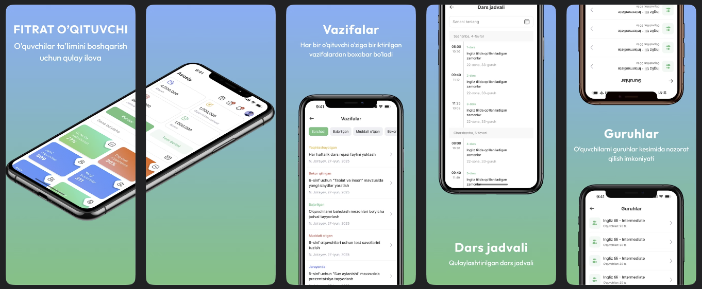

# 📱 Preview

  

# 📚 Fitrat Teachers

**Fitrat Teachers** is a Flutter-based mobile application developed for the **teachers of Fitrat Education Center**.  
It helps teachers **manage students’ attendance, marks, performance statistics**, and **chat directly** with students in one unified platform.

---

## ✨ Features

- 📅 **Attendance Management** – Mark and track student attendance easily.  
- 📊 **Student Statistics** – View performance summaries, progress, and subject stats.  
- 🧾 **Marks Management** – Add, edit, and review students’ marks and test results.  
- 💬 **Chat System** – Communicate directly with students for quick feedback and guidance.  
- 🔔 **Notifications** – Stay updated with class activities and important announcements.  
- 🧑‍🏫 **Teacher Dashboard** – A clean and modern UI designed for teachers’ convenience.

---

## 🔗 Download Links

- 📱 [**Play Store**](https://play.google.com/store/apps/details?id=uz.sectorsoft.fitrat&pcampaignid=web_share)  
- 🍎 [**App Store**](https://apps.apple.com/uz/app/onur-group/id6738658032)

---

## 🛠️ Tech Stack

- **Flutter** – Cross-platform UI framework  
- **Dart** – Main programming language  
- **REST API** – Backend communication  
- **Riverpod & Provider** – State management  
- **Firebase** – Push notifications
- **Yandex AppMetrica** – Analystics & User stats

---

## 👨‍💻 About

Developed by **Abduazim Abduqahhorov**, Flutter Developer (Fitrat Education Center).  
📍 Uzbekistan | ✉️ [abdukhaxxoroff@gmail.com](mailto:abdukhaxxoroff@gmail.com)
